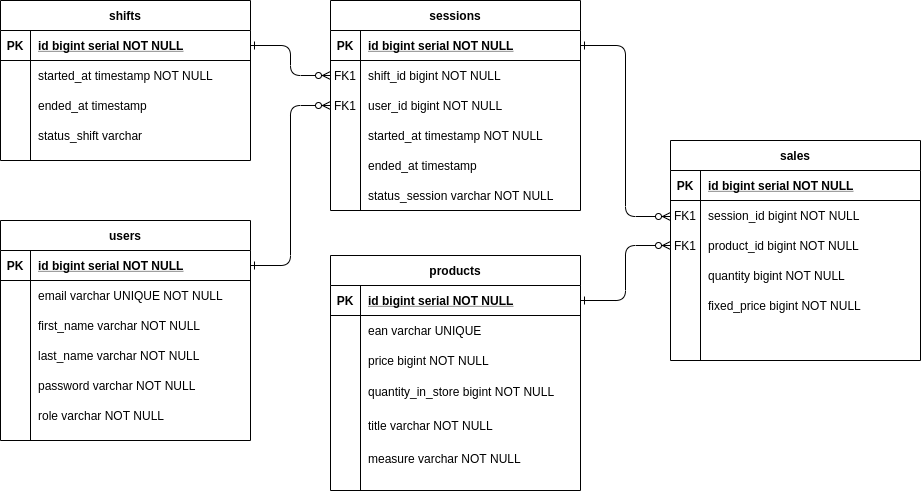

# Проект "Кассовый аппарат"
***
## Описание сущностей базы данных

    ПОЛЬЗОВАТЕЛЬ
Поля | Характеристика
-|-
Идентификатор(id) |  первичный ключ, идентифицирует пользователя
Электронная почта(email) |  идентифицирует пользователя
Имя(first_name), Фамилия(last_name) |  Имя-Фамилия пользователя
Пароль(password) |  Хеш пароля пользователя
Роль(role) |  Роль пользователя, может иметь значения:[Старший кассир(SENIOR_CASHIER), Кассир(CASHIER), Товаровед(COMMODITY_EXPERT)]

    СМЕНА(shifts)
Инфо: 
* Смену может открыть/закрыть только старший кассир
* Смену можно закрыть только тогда, когда все сессии завершены
* Открытая смена может быть только одна (в базе)
* Кассир может начать сессию(новый чек) только когда смена открыта
* После открытия смене, старший кассир может распечатать X чек
* После закрытия смены старший кассир может распечатать Z чек

Поля | Характеристика
-|-
Идентификатор(id) |  первичный ключ, идентифицирует __смену__
Время открытия(started_at) |  Время, фиксируемое в момент, когда пользователь нажмет кнопку "Открыть смену"
Время закрытия(ended_at) |  Время, фиксируемое в момент, когда пользователь нажмет кнопку "Закрыть смену"
Статус смены(status_shift) |  Статус __смены__, может иметь значения:[Открыта(OPENED), Закрыта(CLOSED)]

    ТОВАР(products)
Инфо: 
* Смену может добавить/изменить только товаровед
* Удалить товар из базы невозможно, так как есть вероятность того, что данный продукт покупали, и могут потребовать возврат(возврат TBD)
* Товаровед может изменить в продукте можно только такие поля: название, цену, количество на складе. EAN-13 код остается неизменным
* Товар, количество на складе которого 0, кассир добавить в чек не может
* 

Поля | Характеристика
-|-
Идентификатор(id) |  первичный ключ, идентифицирует смену
Название(title) |  Название __товара__
EAN13-код(ean) |  Уникальный 13-значный код на данном торговом обьекте(в базе)
Цена(price) |  Цена  за 1 еденицу измерения
Количество товара(quantity_in_store) |  Количество __товара__  на складе, количество измеряется в еденицах измерения measure, всегда должно быть >= 0 (ограничение базы)
Еденица измерения(measure) |  Еденица измерения __товара__, может иметь значения:[Килограмм(KILOGRAM), Штука(PIECE)]

    СЕССИЯ(sessions)
Инфо: 
* Сессию(чек) может начать только кассир
* При нажатии кассиром кнопки "Отправить запрос старшему кассиру на редактирование", статус сессии меняется на WAITING и кассир не может больше добавлять товары в чек, пока старший кассир не продолжит(OPENED)/отменит(удаляет все продажи из чека - CLOSED) сессию в чеке
* Сессия со статусом OPENED -  уникальна
* При  нажатии на кнопку "распечатать чек"(возможно, только если статус сессии OPENED), статус сессии меняется на CLOSED и фиксируется время окончания, и печатается чек с QR-кодом(по правилам структуры чека кассового аппарпата)

Поля | Характеристика
-|-
Идентификатор(id) |  первичный ключ, идентифицирует __сессию__
Внешний ключ на таблицу пользователей(user_id) | __сессия__ "относится" к пользователю, который ее начал
Внешний ключ на таблицу смен(shift_id) |  __смена__ включает в себя __сессии__(чеки) разных кассиров
Время открытия(started_at) |  Время, фиксируемое в момент, когда пользователь нажмет кнопку "Открыть сессию"(статус сесси становится OPENED)
Время закрытия(ended_at) |  Время, фиксируемое в момент, когда пользователь нажмет кнопку "Закрыть сессию"(статус сесси становится CLOSED)
Статус сессии(status_session) |  Статус __сессии__, может иметь значения:[Открыта(OPENED), Закрыта(CLOSED), Ожидающая(WAITING)]

    ПРОДАЖА(sales)
Инфо: 
* Продажу в сессии(чеке)  может добавить только кассир
* Связка в базе (session_id - product_id) уникальна: кассир может только один раз указать количество товара в чеке, при второй попытке, произойдет ошибка
* При нажатии пользователем кнопки "добавить в чек" цена товара копируется в цену продажи и фиксируется, при условии, что во время сессии товаровед изменит стоимость данного товара на другую, а у покупателя в "корзине" останется этот же товар(с тем же EAN-13 кодом и названием, ед.изм.), только со старой ценой
* При нажатии пользователем кнопки "добавить в чек" от количества товара на складе, отнимется количество товара, добавленного в чек. В дальнейшем, если чек отменят, то все количество товаров на складе вернется к прежнему значению
* После добавления продажи(товара) в чек, кассир не может отменить ее, для этого он отравляет запрос старшему кассиру на редактирование

Поля | Характеристика
-|-
Идентификатор(id) |  первичный ключ, идентифицирует __продажу__
Внешний ключ на таблицу продктов(product_id) | продажа __продукта__
Внешний ключ на таблицу сессий(product_id) |  __сессия__(чек) включает в себя __продажи__ разных продуктов 
Цена(fixed_price) |  Зафиксированная цена  за 1 еденицу измерения
Количество товара(quantity) |  Количество добавленного в чек товара

***
***
***
## Схема базы данных

